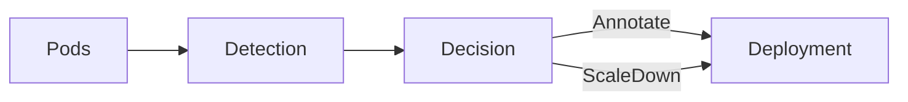

# failure-pattern-operator
Kubernetes operator that watches Deployments and detects restart storms based on Pod restart counts.

## Description
This operator defines a FailurePolicy CRD. Each policy targets a Deployment,
periodically checks Pods selected by that Deployment, and decides whether a
failure pattern is detected. When a pattern is detected and cooldown allows,
the operator executes the configured action.

## Failure Detection Logic
- The controller lists Pods matching the Deployment selector and sums container restart counts.
- It computes a delta: current total restarts minus the last observed total.
- The "window" is one reconcile interval; the controller requeues every
  `spec.detection.windowSeconds`, so the delta represents restarts in that period.
- If delta is negative (e.g., Pod rollout reset), it uses the current total.
- `spec.detection.maxRestarts` is the threshold for triggering FailureDetected.

## Action Types
- `Annotate`: add annotations to the target Deployment with the detected pattern,
  recent restart delta, and timestamp, then update `status.lastActionTime`.
- `ScaleDown`: reduce Deployment replicas by 1 (if replicas > 1), then update
  `status.lastActionTime`.
- Cooldown: actions are skipped while `spec.action.cooldownSeconds` has not elapsed
  since the last action.

## How It Works
1. Observe Pod restart metrics
2. Compute restart delta in sliding window
3. Compare with user-defined threshold
4. Decide remediation action
5. Apply action with safety guards



## CRD Spec and Status
Spec fields:
- `spec.target`: `kind`, `name`, `namespace` for the workload to monitor (Deployment only).
- `spec.detection`: `windowSeconds` for the evaluation interval and `maxRestarts` threshold.
- `spec.action`: `type` (`Annotate` or `ScaleDown`) and `cooldownSeconds`.
- `spec.notification`: enable notifications and reference a webhook Secret.

Status fields:
- `status.lastCheckedTime`: last time the policy was evaluated.
- `status.failureDetected`: whether the failure condition is currently met.
- `status.recentRestartDelta`: restart delta observed in the latest window.
- `status.lastObservedTotalRestarts`: running total used to compute delta.
- `status.lastActionTime`: last time an action executed.

## Notifications
Create a Secret that stores the webhook URL, then reference it from the FailurePolicy spec.

Example Secret:
```yaml
apiVersion: v1
kind: Secret
metadata:
  name: failure-notify-webhook
  namespace: default
type: Opaque
stringData:
  url: https://discord.com/api/webhooks/...
```

Example FailurePolicy:
```yaml
spec:
  notification:
    enabled: true
    type: discord
    secret: failure-notify-webhook
```

## Getting Started

### Prerequisites
- go version v1.24.6+
- docker version 17.03+.
- kubectl version v1.11.3+.
- Access to a Kubernetes v1.11.3+ cluster.

### To Deploy on the cluster
**Build and push your image to the location specified by `IMG`:**

```sh
make docker-build docker-push IMG=<some-registry>/failure-pattern-operator:tag
```

**NOTE:** This image ought to be published in the personal registry you specified.
And it is required to have access to pull the image from the working environment.
Make sure you have the proper permission to the registry if the above commands don’t work.

**Install the CRDs into the cluster:**

```sh
make install
```

**Deploy the Manager to the cluster with the image specified by `IMG`:**

```sh
make deploy IMG=<some-registry>/failure-pattern-operator:tag
```

> **NOTE**: If you encounter RBAC errors, you may need to grant yourself cluster-admin
privileges or be logged in as admin.

**Create instances of your solution**
You can apply the samples (examples) from the config/sample:

```sh
kubectl apply -k config/samples/
```

>**NOTE**: Ensure that the samples has default values to test it out.

### To Uninstall
**Delete the instances (CRs) from the cluster:**

```sh
kubectl delete -k config/samples/
```

**Delete the APIs(CRDs) from the cluster:**

```sh
make uninstall
```

**UnDeploy the controller from the cluster:**

```sh
make undeploy
```

## Project Distribution

Following the options to release and provide this solution to the users.

### By providing a bundle with all YAML files

1. Build the installer for the image built and published in the registry:

```sh
make build-installer IMG=<some-registry>/failure-pattern-operator:tag
```

**NOTE:** The makefile target mentioned above generates an 'install.yaml'
file in the dist directory. This file contains all the resources built
with Kustomize, which are necessary to install this project without its
dependencies.

2. Using the installer

Users can just run 'kubectl apply -f <URL for YAML BUNDLE>' to install
the project, i.e.:

```sh
kubectl apply -f https://raw.githubusercontent.com/<org>/failure-pattern-operator/<tag or branch>/dist/install.yaml
```

### By providing a Helm Chart

1. Build the chart using the optional helm plugin

```sh
kubebuilder edit --plugins=helm/v2-alpha
```

2. See that a chart was generated under 'dist/chart', and users
can obtain this solution from there.

**NOTE:** If you change the project, you need to update the Helm Chart
using the same command above to sync the latest changes. Furthermore,
if you create webhooks, you need to use the above command with
the '--force' flag and manually ensure that any custom configuration
previously added to 'dist/chart/values.yaml' or 'dist/chart/manager/manager.yaml'
is manually re-applied afterwards.

## Contributing
// TODO(user): Add detailed information on how you would like others to contribute to this project

**NOTE:** Run `make help` for more information on all potential `make` targets

More information can be found via the [Kubebuilder Documentation](https://book.kubebuilder.io/introduction.html)

## License

Copyright 2025.

Licensed under the Apache License, Version 2.0 (the "License");
you may not use this file except in compliance with the License.
You may obtain a copy of the License at

    http://www.apache.org/licenses/LICENSE-2.0

Unless required by applicable law or agreed to in writing, software
distributed under the License is distributed on an "AS IS" BASIS,
WITHOUT WARRANTIES OR CONDITIONS OF ANY KIND, either express or implied.
See the License for the specific language governing permissions and
limitations under the License.
